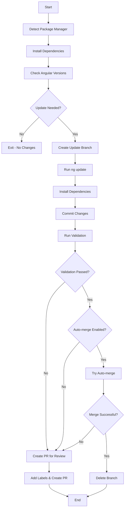

# Angular CLI Update Action

[](https://github.com/gridatek/ng-update-action/actions/workflows/ci.yml)
[](https://github.com/gridatek/ng-update-action/releases)

Automatically update Angular CLI workspaces to the latest version with validation and smart PR creation. This GitHub Action runs `ng update` commands, validates the changes, and can either auto-merge successful updates or create pull requests for review.

## Features

- 🚀 **Automatic Angular CLI Updates** - Updates `@angular/core`, `@angular/cli`, and additional packages
- 📦 **Multi-Package Manager Support** - Works with npm, yarn, and pnpm
- ✅ **Built-in Validation** - Runs build, test, lint, and custom validation commands
- 🔀 **Smart PR Management** - Auto-merge successful updates or create PRs for review
- 🏷️ **Flexible Version Targeting** - Support for `latest`, `next`, `rc`, or specific versions
- 🌳 **Branch Protection Aware** - Respects repository branch protection rules
- 🧪 **Dev Mode** - Special testing mode with unique branch naming

## Quick Start

Add this workflow to your repository at `.github/workflows/ng-update.yml`:

```yaml
name: Angular Update

on:
  schedule:
    - cron: '0 2 * * 1' # Run every Monday at 2 AM
  workflow_dispatch: # Allow manual trigger

jobs:
  update:
    runs-on: ubuntu-latest
    steps:
      - uses: actions/checkout@v4
        with:
          token: ${{ secrets.GITHUB_TOKEN }}

      - uses: actions/setup-node@v4
        with:
          node-version: '20'

      - uses: gridatek/ng-update-action@v1
        env:
          GITHUB_TOKEN: ${{ secrets.GITHUB_TOKEN }}
        with:
          package-manager: npm
          validation-commands: 'build,test'
          merge-strategy: auto-merge
```

## Configuration Options

### Inputs

| Input                   | Description                                                    | Default            | Required |
| ----------------------- | -------------------------------------------------------------- | ------------------ | -------- |
| `angular-package`       | The Angular package to check for updates                       | `@angular/core`    | No       |
| `angular-version`       | Angular version to use (latest, next, rc, or specific version) | `latest`           | No       |
| `additional-packages`   | Additional Angular packages to update (comma-separated)        | `@angular/cli`     | No       |
| `package-manager`       | Package manager to use (npm, yarn, pnpm)                       | `npm`              | No       |
| `validation-commands`   | Commands to run for validation (comma-separated)               | `build`            | No       |
| `affected`              | Only validate affected projects (true) or all projects (false) | `true`             | No       |
| `merge-strategy`        | Merge strategy after validation (auto-merge, always-pr)        | `auto-merge`       | No       |
| `pr-labels`             | Labels to add to PRs (comma-separated)                         | `ng-update-action` | No       |
| `commit-message-prefix` | Prefix for commit messages                                     | `build`            | No       |
| `target-branch`         | Target branch for merging changes                              | `main`             | No       |
| `working-directory`     | Working directory                                              | `.`                | No       |
| `skip-initial-install`  | Skip initial dependency installation                           | `false`            | No       |
| `dev-mode`              | Enable dev mode for testing                                    | `false`            | No       |

### Outputs

| Output              | Description                           |
| ------------------- | ------------------------------------- |
| `updated`           | Whether Angular was updated           |
| `current-version`   | Current Angular version before update |
| `latest-version`    | Latest Angular version                |
| `validation-result` | Result of validation tests            |
| `pr-url`            | URL of created PR (if any)            |

## Usage Examples

### Basic Usage with Auto-merge

```yaml
- uses: gridatek/ng-update-action@v1
  env:
    GITHUB_TOKEN: ${{ secrets.GITHUB_TOKEN }}
  with:
    package-manager: npm
    validation-commands: 'build'
    merge-strategy: auto-merge
```

### Always Create PR for Review

```yaml
- uses: gridatek/ng-update-action@v1
  env:
    GITHUB_TOKEN: ${{ secrets.GITHUB_TOKEN }}
  with:
    package-manager: yarn
    validation-commands: 'build,test,lint'
    merge-strategy: always-pr
    pr-labels: 'dependencies,angular-update'
```

### Update to Specific Version

```yaml
- uses: gridatek/ng-update-action@v1
  env:
    GITHUB_TOKEN: ${{ secrets.GITHUB_TOKEN }}
  with:
    angular-version: '17.3.0'
    additional-packages: '@angular/cli,@angular/material'
    validation-commands: 'build,test'
```

### Update to Next/RC Version

```yaml
- uses: gridatek/ng-update-action@v1
  env:
    GITHUB_TOKEN: ${{ secrets.GITHUB_TOKEN }}
  with:
    angular-version: 'next'
    validation-commands: 'build'
    merge-strategy: always-pr
```

### Custom Validation Commands

```yaml
- uses: gridatek/ng-update-action@v1
  env:
    GITHUB_TOKEN: ${{ secrets.GITHUB_TOKEN }}
  with:
    validation-commands: 'build,test,lint,npm run e2e'
    working-directory: './frontend'
```

### Matrix Testing (Dev Mode)

```yaml
strategy:
  matrix:
    package-manager: [npm, yarn, pnpm]
    node-version: [18, 20, 22]

steps:
  - uses: gridatek/ng-update-action@v1
    env:
      GITHUB_TOKEN: ${{ secrets.GITHUB_TOKEN }}
    with:
      package-manager: ${{ matrix.package-manager }}
      dev-mode: true
      validation-commands: 'build,test'
```

## How It Works



## Validation Commands

The action supports several built-in validation commands:

- **`build`** - Runs `ng build --configuration production`
- **`test`** - Runs `ng test --watch=false --browsers=ChromeHeadless --code-coverage`
- **`lint`** - Runs `ng lint`
- **`e2e`** - Runs `ng e2e`
- **Custom commands** - Any command can be specified and will be executed as-is

## Package Manager Support

The action automatically detects your package manager based on lock files:

- **npm** - Uses `package-lock.json`
- **yarn** - Uses `yarn.lock`
- **pnpm** - Uses `pnpm-lock.yaml`

You can also explicitly specify the package manager using the `package-manager` input.

## Branch Naming

- **Production mode**: `ng-update-{version}` (e.g., `ng-update-17.3.0`)
- **Dev mode**: `ng-update-{version}-{pkg-manager}-node{version}-{run-id}-{job-id}`

## Troubleshooting

### Common Issues

1. **Action fails with permission errors**
   - Ensure `GITHUB_TOKEN` has write permissions to the repository
   - Check that branch protection rules allow the action to create/merge branches

2. **ng update fails with dependency conflicts**
   - The action uses `--force` flag to handle most conflicts
   - Consider updating packages individually by specifying them separately

3. **Validation fails unexpectedly**
   - Check the validation command outputs in the action logs
   - Ensure your project builds successfully before running the action

4. **Auto-merge doesn't work**
   - Verify branch protection settings allow auto-merge
   - Check that required status checks are configured correctly

### Angular CLI Version Compatibility

Different Angular versions require specific Node.js versions:

| Angular Version | Node.js Version  |
| --------------- | ---------------- |
| 15.x            | 16.x, 18.x       |
| 16.x            | 16.x, 18.x       |
| 17.x            | 18.x, 20.x       |
| 18.x            | 18.x, 20.x, 22.x |

Make sure your workflow uses a compatible Node.js version.

## Contributing

Contributions are welcome! Please read our [Contributing Guide](CONTRIBUTING.md) for details on our code of conduct and the process for submitting pull requests.

## License

This project is licensed under the MIT License - see the [LICENSE](LICENSE) file for details.

## Acknowledgments

This action is inspired by and follows patterns from [nx-migrate-action](https://github.com/gridatek/nx-migrate-action).
